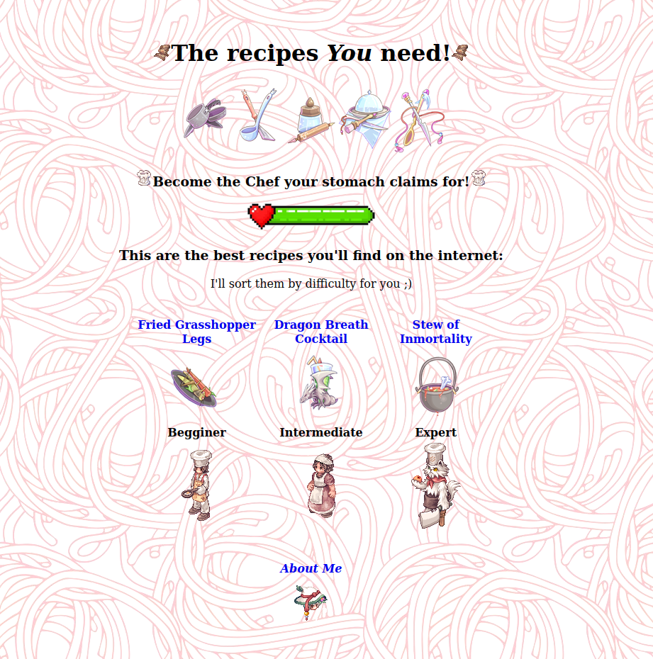

<div align="center"> 
<h1>Pure-HTML recipes website</h1>
<p>Ragnarok Online assets wrapped on a 100% HTML site</p>

<p><em>The simpler, the better</em></p>
</div>

## My very first proyect!

The idea really came to be as the first proyect assignment from [The Odin Proyect](https://www.theodinproject.com/lessons/foundations-recipes), wich, usless to say, I'm following daily, deeply in love with it.
Since it is, at is core, not a tutorial, that give some room to make my own take on it.
The Odin objective was simple, and afterwards I found out that most solutions were mostly plain blank html files, or they implemented some CSS to it.
So I really wanted to give myself the constrain to work only with HTML, and make something that weren't just a few links and some text, but at the same time use HTML only.

## The inspiration

I looked trough the internet to some Old School sites and really found out some inspiration there, mostly coming from [SpaceJam Website](https://www.spacejam.com/1996/),
really love the design idea, and started looking to the implementation, mostly inspecting the DOM. So that way I found they cleverly used Table Cells to align everything, plus the, nowadays depracated ```align=""``` property.


## Targeted Objectives

✅ No CSS
✅ Accessible from Mobile
✅ Multiple pages
✅ 'To the top' link
✅ Pleasently looking background
✅ 90's vibe.


## Disclaimer

Most Assets come from a game called Ragnarok Online. I do not hold any rigths over any of the images shown here. And I am not affiliated to Ragnarok Online nor Gravity. This is purely use for educational-learning purposes. 

The images displayed in this collection are not owned or copyrighted by me. They belong to their respective creators and rights holders. If you believe your copyright has been infringed, please contact me with proof of ownership and I will take them down.

Deleted the old repository and reupload here. Commits weren't many nor good. So thats all fine! 
